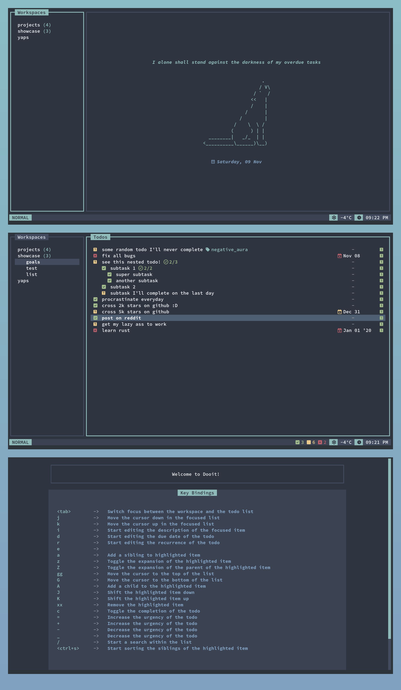
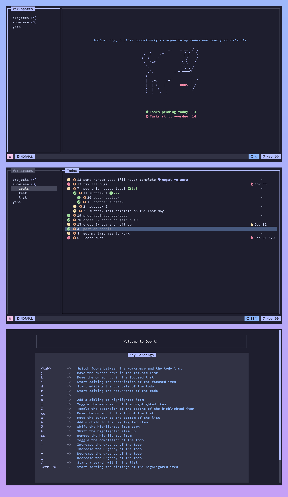
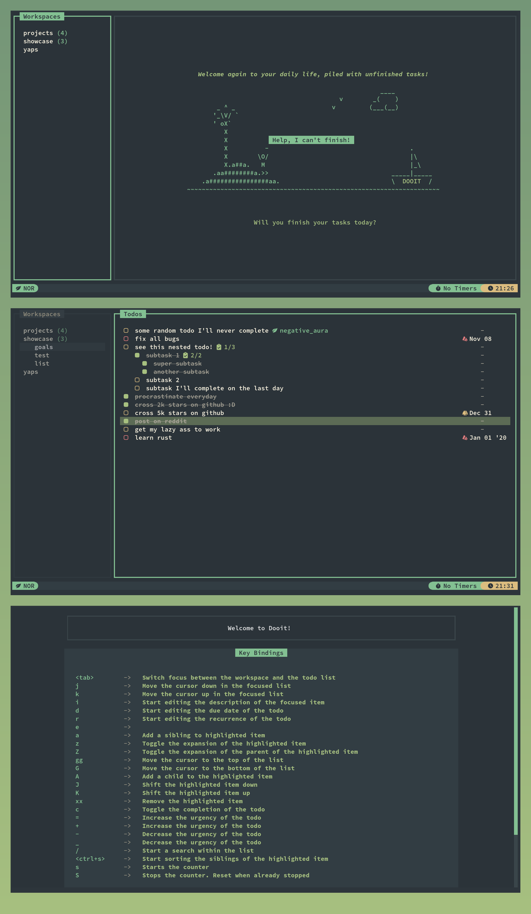

# Dooit Extras 🪄

A collection of utilities to customize your [dooit](https://github.com/dooit-org/dooit)

--------------

For installation and configuration, check out [the wiki](https://dooit-org.github.io/dooit-extras/)

## Screenshots 

Some screenshots of app configs done with dooit-extras!

  
An icy configuration based on NordTheme ❄️ 

  

  
A colorful configuration based on Catpuccin 🐱 

  

  
  
A calm configuration based on Everforest 🌲 

  

