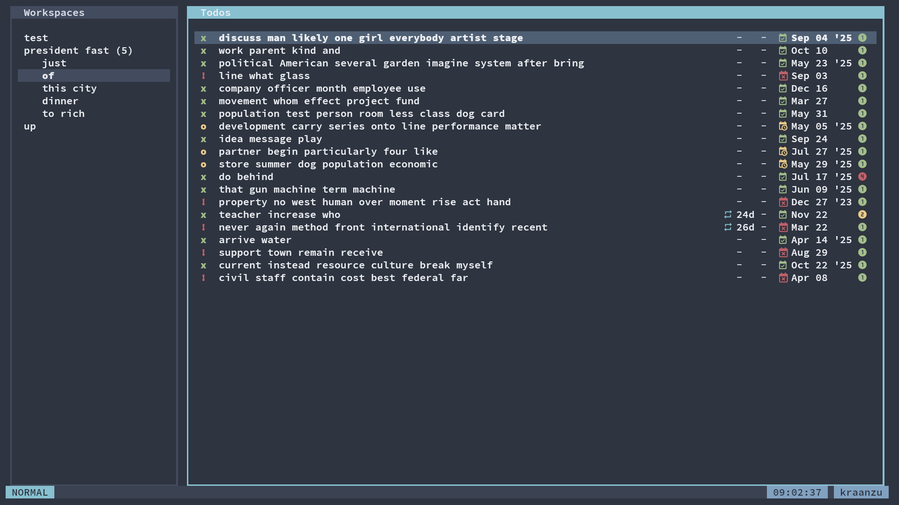

# Custom Tree Borders

This script allows you to edit the border for workspaces and todo trees

Check out available border types [here](https://textual.textualize.io/styles/border/#all-border-types)

Example:

```py
from dooit.ui.api import DooitAPI, subscribe
from dooit.ui.api.events import Startup
from dooit_extras.scripts import custom_tree_borders

@subscribe(Startup)
def setup(api: DooitAPI, _):
   custom_tree_borders(api, "panel", "panel")
```

Preview:


