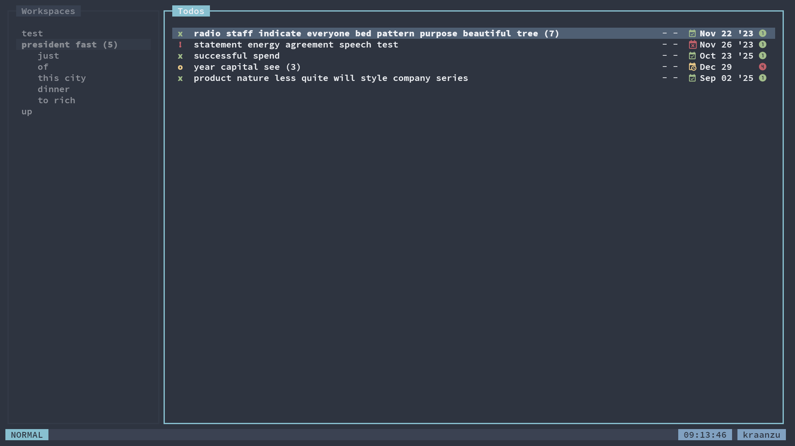
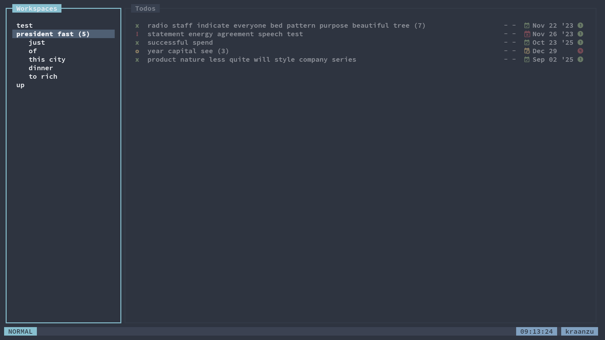

# Dim Unfocused

This script allows you to dimmify workspaces or todo tree which is Unfocused
The value for opacity is in the format: `<number>%` where number can be from 1 till 100

| Param|<div style="width: 100px">Default</div> |Description|
| ------------- | :----------------:  | :----------------------------------------------------------------------------------------|
| opacity       |  `"50%"`            | The opacity of the unfocused tree                                                        |

Example:

```py
from dooit.ui.api import DooitAPI, subscribe
from dooit.ui.api.events import Startup
from dooit_extras.scripts import dim_unfocused

@subscribe(Startup)
def setup(api: DooitAPI, _):
    dim_unfocused(api, "50%")
```

Preview:




