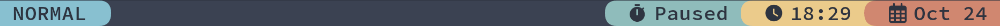
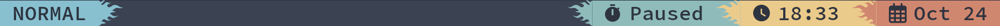

# Powerline

Widget store that provides various powerline separators

| Key|<div style="width: 100px">Default</div> |Description|
| ------------- | :----------------:  | :----------------------------------------------------------------------------------------|
| api           |                     | The api object provided within the function                                              |
| fmt           | `" {} "`            | Specify how the text should be formatted, `{}` represents the value that'll be displayed |
| fg            | `theme.foreground_1`| Color to show the text in, defaults to `theme.foreground_1` or `white` based on theme    |
| bg            | `theme.primary`     | Color to show the background in, defaults to `theme.primary` or `accent` based on theme  |


## Triangles


```python
from dooit_extras.bar_widgets import Powerline
from dooit.ui.api.events import subscribe, Startup

@subscribe(Startup)
def setup(api, _):
    api.bar.set(
        [
            # ...
            Powerline.lower_left_triangle(...),
            Powerline.lower_right_triangle(...),

            Powerline.upper_left_triangle(...),
            Powerline.upper_right_triangle(...),
            # ...
        ]
    )
```

::: info
The preview image for triangles was created with a combination of different triangle separators (4)
:::

## Rounded


```python
from dooit_extras.bar_widgets import Powerline
from dooit.ui.api.events import subscribe, Startup

@subscribe(Startup)
def setup(api, _):
    api.bar.set(
        [
            # ...
            Powerline.left_rouned(...),
            Powerline.right_rounded(...),
            # ...
        ]
    )
```

## Arrows

```python
from dooit_extras.bar_widgets import Powerline
from dooit.ui.api.events import subscribe, Startup

@subscribe(Startup)
def setup(api, _):
    api.bar.set(
        [
            # ...
            Powerline.left_arrow(...),
            Powerline.right_arrow(...),
            # ...
        ]
    )
```

## Ice

```python
from dooit_extras.bar_widgets import Powerline
from dooit.ui.api.events import subscribe, Startup

@subscribe(Startup)
def setup(api, _):
    api.bar.set(
        [
            # ...
            Powerline.left_ice(...),
            Powerline.right_ice(...),
            # ...
        ]
    )
```

## Flame

```python
from dooit_extras.bar_widgets import Powerline
from dooit.ui.api.events import subscribe, Startup

@subscribe(Startup)
def setup(api, _):
    api.bar.set(
        [
            # ...
            Powerline.left_flame(...),
            Powerline.right_flame(...),
            # ...
        ]
    )
```
